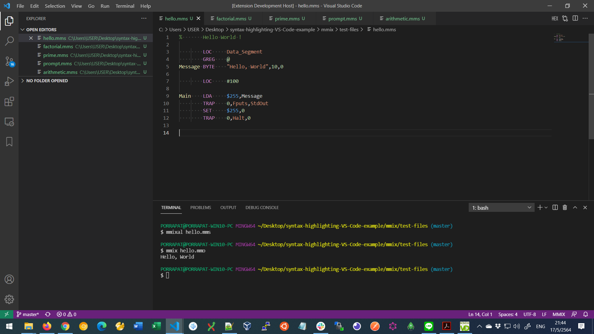

# MMIX assembly highlighting for Visual Studio Code

Adds syntax highlighting for the MMIX Assembly language to Visual Studio Code. 

## Install

First install [Visual Studio Code](https://code.visualstudio.com). In the command palette (`cmd-shift-p`) select `Install Extension` and choose `MMIX`.

## Reference

* The Art Of Computer Programming Reading Group ([Meetup](https://www.meetup.com/theartofcomputerprogramming/)) ([Facebook](https://www.facebook.com/groups/678335496099220)) ([Github](https://github.com/theartofcomputerprogramming))
* [Extension Page on Microsoft](https://marketplace.visualstudio.com/items?itemName=Porrapat.vscode-mmix)
* [Donald Knuth Homepage](https://www-cs-faculty.stanford.edu/~knuth/)
* [MMIX Homepage by Martin Rucklert](http://mmix.cs.hm.edu/)

## Screenshot

|  | 
|:--:| 
| *Screenshot 1 Hello World* |

|  | 
|:--:| 
| *Screenshot 2 Hello World with changed theme* |

|  | 
|:--:| 
| *Screenshot 3 Finding factorial program* |

|  | 
|:--:| 
| *Screenshot 4 Finding 500 primes program* |

|  | 
|:--:| 
| *Screenshot 5 Finding 500 primes program with changed color theme* |

## How to do Hello World MMIX

Go to [MMIX Homepage](http://mmix.cs.hm.edu/), or I will write this more easy info for you next here.

## Roadmap - What to do next

* Fix bug on the issue
* MIX (Old language of MMIX) Syntax Higlighter
* More Easy MMIX IDE Feature like Code Formatting, Auto Complete, Code Snippet Template
* MMIX Visual Debugger on VSCode that can run on many platflom
* MMIX Visual Debugger on Web, that you can open it by any web browser
* MMIX Online Code Judge that we keep problems and score you can solve it

## License
[MIT](LICENSE)
